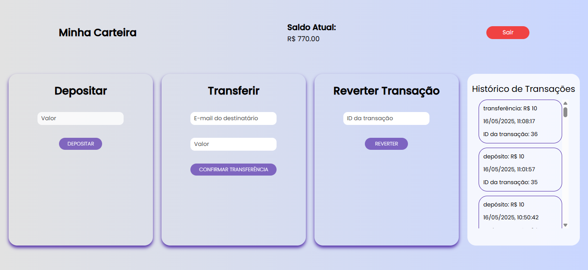

# 💰 Carteira Financeira - Frontend

Interface web para cadastro, login de usuários e gerenciamento de transações financeiras, como depósitos, transferências e reversões. Além do histórico de transações do usuário logado.

---

## 🖼️ Interface

---

## 📦 Tecnologias usadas

- **React** (com Vite)
- **TypeScript**
- **React Router DOM**
- **Axios**
- **CSS**

---

## ⚙️ Funcionalidades

- Tela de login e cadastro com validação
- Armazenamento de token JWT no `localStorage`
- Dashboard com exibição de saldo atualizado
- Depósito em conta com atualização em tempo real
- Transferência de saldo entre usuários
- Reversão de transações com controle de saldo
- Histórico de transações com tipo, valor, data e ID

---

## 🚀 Como rodar o projeto localmente

### ✅ Pré-requisitos

- Node.js instalado  
- Backend da API no repositório: https://github.com/viniciusfernandes08/carteira-backend em funcionamento (porta 3000 por padrão)

### 🔧 Passos

1. Clone o repositório:
   git clone https://github.com/viniciusfernandes08/carteira-frontend

2. Instale as dependências:

   npm install

3. Inicie o servidor de desenvolvimento:

   npm run dev

A aplicação será executada no navegador, normalmente em http://localhost:5173

## 🔐 Como usar
 *Após iniciar o backend e o frontend:*

- Cadastre um usuário na interface inicial

- Faça login usando as mesmas credenciais

- Navegue até o Dashboard e utilize as opções:

   **Depósito**
   
   **Transferência**
   
   **Reversão**

- O histórico de transações e o saldo serão atualizados automaticamente

- Use o botão Sair para encerrar a sessão (token removido)

## ✅ Boas práticas implementadas
- Validação de e-mail e senha no frontend

- Feedback de carregamento e alertas em caso de erro

- Armazenamento seguro do token JWT no localStorage

- Componentização das ações financeiras (Deposit, Transfer, Reverse)

- Separação de lógica de autenticação e navegação

- Requisições protegidas com header Authorization: Bearer < token >

## 👤 Autor

*Vinícius Fernandes de Oliveira*